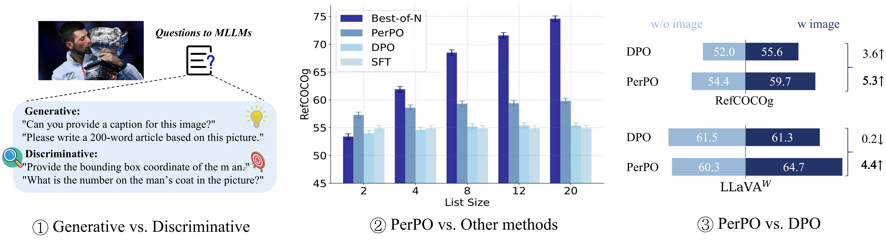
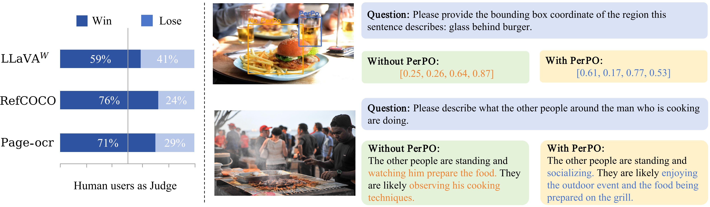

<h3><a href="">PerPO: Perceptual Preference Optimization via Discriminative Rewarding</a></h3>
<a href=""></a>
<a href=""></a> 

Zining Zhu*, [Liang Zhao*](), Kangheng Lin*, Jinze Yang, [En Yu](https://ahnsun.github.io/), Chenglong Liu, [Haoran Wei](https://scholar.google.com/citations?user=J4naK0MAAAAJ&hl=en), [Jianjian Sun](https://scholar.google.com/citations?user=MVZrGkYAAAAJ&hl=en), [Zheng Ge](https://joker316701882.github.io/), [Xiangyu Zhang](https://scholar.google.com/citations?user=yuB-cfoAAAAJ&hl=en)

<p align="center">

</p>


## Contents
- [Get Started](#get-started)
- [Data Preparation](#data-preparation)
- [Model Training](#model-training)
- [Main Results](#main-results)


## Get Started
1. clone this repository and navigate to the PerPO folder

```
git clone https://github.com/ningerhhh/PerPO.git
cd PerPO
```

2. create a new conda environment

```
conda create -n perpo python==3.9
```

3. install requirements

```
conda activate perpo
pip install -e .
```

## Data Preparation
The data format is as shown in [data.json](assets/data.json), and you can use your own dataset for training.

## Model Training

We present the training code for LLaVA-v1.5, with the parameter settings provided for reference. The models used in this framework are available for download on Hugging Face.

<details>
<summary> Training Script </summary>

```Shell
deepspeed perpo/models/llava-v1_5/train_perpo_lora.py \
    --lora_enable True --lora_r 128 --lora_alpha 256 --mm_projector_lr 5e-6 \
    --deepspeed ./perpo/models/llava-v1_5/scripts/zero3.json \
    --model_name_or_path /models/llava-v1.5-7b \
    --version v1 \
    --ours_data_path ./data/llava1.5_7b_refcoco_data.json \
    --vision_tower /models/clip-vit-large-patch14-336 \
    --tune_mm_mlp_adapter False \
    --freeze_backbone False \
    --mm_projector_type mlp2x_gelu \
    --mm_vision_select_layer -2 \
    --mm_use_im_start_end False \
    --mm_use_im_patch_token False \
    --image_aspect_ratio pad \
    --group_by_modality_length True \
    --bf16 True \v
    --output_dir ./checkpoints/llava1.5_7b_lora_perpo \
    --num_train_epochs 1 \
    --per_device_train_batch_size 2 \
    --per_device_eval_batch_size 4 \
    --gradient_accumulation_steps 1 \
    --evaluation_strategy "no" \
    --save_strategy "steps" \
    --save_steps 50000 \
    --save_total_limit 1 \
    --learning_rate 5e-6 \
    --weight_decay 0. \
    --warmup_steps 0 \
    --lr_scheduler_type "cosine" \
    --logging_steps 1 \
    --tf32 True \
    --model_max_length 2048 \
    --gradient_checkpointing True \
    --dataloader_num_workers 4 \
    --lazy_preprocess True \
    --report_to wandb \
    --run_name "llava1.5_7b_lora_perpo" \
    --beta 0.1 \
    --perpo_gamma 0.5 \
    --best_of_n 20
```

</details>


## Main Results


<details>
<summary> Object Grounding </summary>


| Methods           | Ref val | Ref testA | Ref testB | Ref+ val | Ref+ testA | Ref+ testB | Refg val | Refg test | LLaVA^W | MMHal Score ↑ | MMHal HalRate ↓ | POPE |
|-------------------|-------------|---------------|---------------|--------------|----------------|----------------|--------------|---------------|---------------------|----------------------|------|------|
| LLaVA-v1.5-7B     | 50.0        | 59.9          | 43.3          | 45.8         | 55.2           | 34.6           | 49.4         | 49.3          | 61.8                | 2.11                 | **0.54** |  86.1   |
| + SFT             | 59.4        | 66.6          | 49.2          | 52.0         | 61.1           | 40.2           | 54.9         | 54.7          | 62.0                | 2.16                 | 0.61 |   86.1  |
| + DPO             | 60.6      | 67.8            | 50.5          | 53.3       | 62.1         | 41.4               | 55.9       | 55.1          | 61.3                | 2.08                 | 0.62 |   86.3  |
| + PerPO           | **63.8**    | **70.6**      | **54.4**      | **57.3**     | **65.9**       | **46.9**       | **60.0**     | **59.6**      | **64.0**            | **2.26**             | 0.57 | **86.5** |
| LLaVA-NEXT-7B     | 84.9        | 90.5          | 77.3          | 77.6       | 86.8           | 67.0             | 80.7         | 80.3          | 72.7                | 2.79               | 0.48 | 87.5 |
| + SFT             | 84.6        | 90.3          | 77.1          | 77.5         | 86.5           | 67.4           | 81.3       | 80.2           | 75.0                | 2.57                 | 0.48 | **87.6** |
| + DPO             | 85.5      | 90.8            | 78.8          | **78.1**     | 86.9         | 68.0             | 81.0         | 81.1         | 77.6              | 2.69                 | 0.49 | 87.5 |
| + PerPO           | **86.7**    | **91.3**      | **81.0**      | 69.4         | **87.3**       | **70.1**       | **82.4**     | **82.4**      | **81.2**            | **2.81**             | **0.46** | **87.6** |
| LLaVA-OneVision | 73.6     | 82.6      | 63.8   | 69.4     | 79.5 | 58.2 | 71.1 | 70.8 | 79.7 | 2.70            | 0.41        | 88.3 |
| + SFT           | 74.7     | 83.7      | 65.4   | 70.3     | 80.8 | 59.1 | 72.1 | 71.7 | 77.9 | 2.73            | 0.40        | 88.1 |
| + DPO           | 79.5 | 86.5  | 71.1| 74.6 | 83.4 | 64.5 | 76.3 | 76.1 | 80.1 | 2.75        | 0.39    | 88.4 |
| + PerPO         | **82.2** | **88.1**  | **75.6**| **77.3** | **85.3** | **68.4** | **79.6** | **79.9** | **83.3** | **2.82**        | **0.37**    | **88.8** |


</details>


<details>
<summary> Dense OCR </summary>


| Methods               | Edit Dist ↓ | F1 ↑  | Prec ↑ | Rec ↑ | BLEU ↑ | METEOR ↑ | LLaVA^W | MMHal Score ↑ | MMHal HalRate ↓ | POPE |
|-----------------------|-------------|-------|--------|-------|--------|----------|-------------------------|---------------------|-----------------------|------|
| LLaVA-Next-25k-7B     | 0.67        | 0.47  | 0.71   | 0.37  | 0.16   | 0.28     | **68.9**                | 2.79                | 0.42                  | 89.0 |
| + SFT                 | 0.66        | 0.47  | 0.72 | 0.38  | 0.17   | 0.29     | 67.8                    | 2.85                | 0.42                  | 89.0 |
| + DPO                 | 0.61      | 0.51  | **0.73**| 0.41| 0.20 | 0.32   | 68.3                    | **2.95**            | 0.40                | 89.0 |
| + PerPO               | **0.58**    | **0.54**| **0.73**| **0.44**| **0.23**| **0.36**| 68.4                | 2.92              | **0.39**              | 89.0 |
| LLaVA-Next-50k-7B     | 0.64        | 0.51  | 0.74 | 0.41  | 0.18   | 0.31     | 70.2                    | 2.97                | 0.36                | 89.6 |
| + SFT                 | 0.62        | 0.52  | 0.74 | 0.42  | 0.20   | 0.32     | 69.8                  | **3.15**            | **0.34**              | 89.9 |
| + DPO                 | 0.60      | 0.54| **0.75**| 0.43| 0.21 | 0.33   | 69.2                    | 3.10              | 0.36                | **90.0** |
| + PerPO               | **0.56**    | **0.56**| **0.75**| **0.46**| **0.24**| **0.36**| **71.5**                | 3.00                | 0.36                | **90.0** |


</details>

<details>
<summary> Qualitative analysis</summary>

<p align="center">

</p>
</details>

## Contact
If you have any questions related to the code or the paper, feel free to email (`zhuzining20@mails.ucas.ac.cn`，`zhaoliang02@stepfun.com`).

## Acknowledgement

   - [LLaVA-v1.5](https://github.com/haotian-liu/LLaVA). The LLaVA-v1.5 part of PerPO is based on the official LLaVA-v1.5 implementation, which is a great open-source work on LVLM.
   - [LLaVA-NeXT](https://github.com/LLaVA-VL/LLaVA-NeXT). The LLaVA-NeXT part of PerPO is based on the official LLaVA-NeXT implementation, which is a great open-source work on LVLM.
   - [HA-DPO](https://github.com/opendatalab/HA-DPO). The PerPO is based on the official HA-DPO implementation, which is a great open-source work on LVLM.
   


## Citation
If you find our work useful in your research, please consider citing PerPO:
```bibtex
@article{zhu2025perpo,
  title={PerPO: Perceptual Preference Optimization via Discriminative Rewarding},
  author={Zhu, Zining and Zhao, Liang and Lin, Kangheng and Yang, Jinze and Yu, En and Liu, Chenglong and Wei, Haoran and Sun, Jianjian and Ge, Zheng and Zhang, Xiangyu},
  journal={arXiv preprint arXiv:2502.04371},
  year={2025}
}

```
